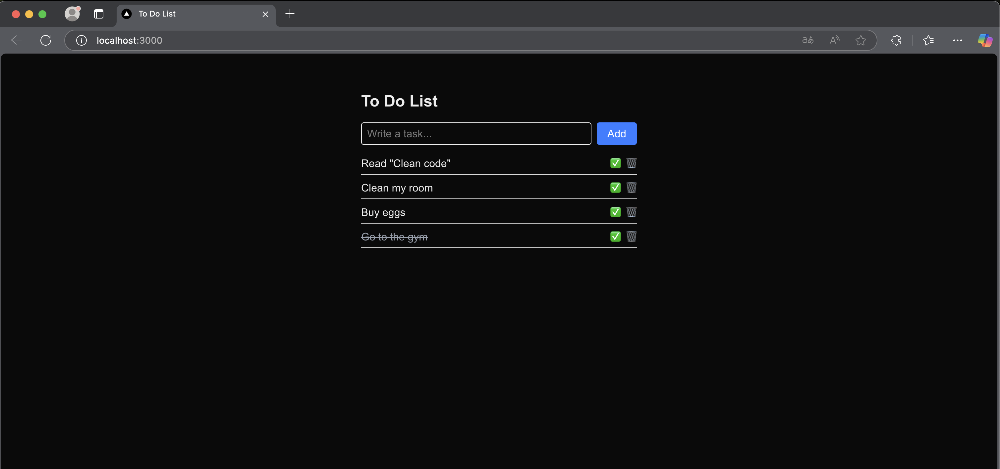

# 📝 To Do List App

A task management app built with Next.js 15, React, TypeScript, and Tailwind CSS. It allows users to add, complete, and delete tasks. Tasks are stored in localStorage for session persistence.

---

## 🚀 Technologies

- [Next.js 15 (App Router)](https://nextjs.org/docs)
- [React 19](https://react.dev/)
- [TypeScript](https://www.typescriptlang.org/)
- [Tailwind CSS 4](https://tailwindcss.com/)
- `localStorage` for persistent storage

---

## ✨ Features

- ✅ Add tasks using an input field
- ✅ Mark tasks as completed
- 🗑 Delete tasks
- 💾 Auto-save to `localStorage`
- ♻️ Modular code with separated components (`TaskItem`)
- 🧩 Strong type safety with TypeScript

---

## 📸 Screenshots



---

## 💻 Installation

```bash
# Clone the repository
git clone https://github.com/Hewerth-dev/to-do-list.git
cd todo-app-ts

# Install dependencies
npm install

# Run the project
npm run dev
